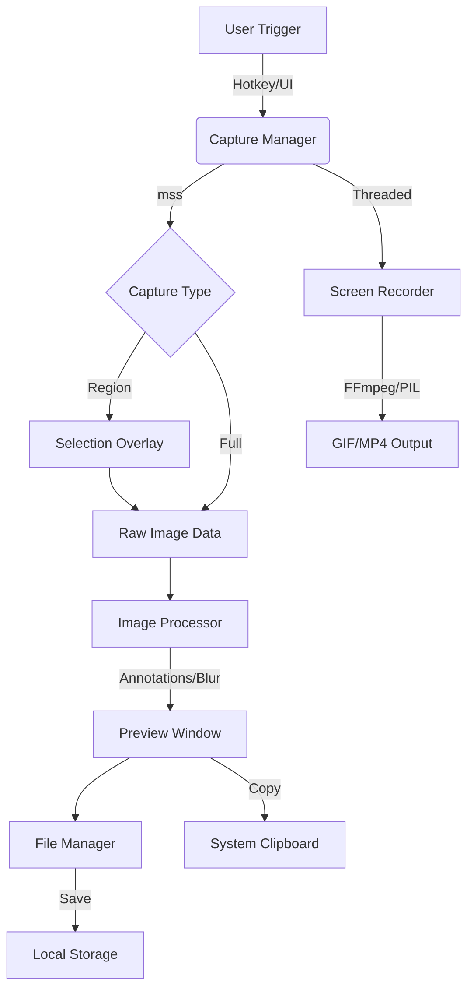

<div align="center">


[](https://www.python.org/)
[](https://docs.python.org/3/library/tkinter.html)
[](https://python-pillow.org/)
[](https://github.com/)

<p align="center">
  
</p>

---


</div>

## 🌟 Overview

**LightShot Ultra** is a high-performance, desktop-integrated screen capture and recording utility built with Python. Designed for speed and precision, it mimics professional tools with a minimalist dark-themed UI, multi-monitor support via `mss`, and a robust suite of annotation tools. Whether you need a quick region crop, a full-screen grab, or a high-quality GIF/MP4 recording, LightShot handles it with zero latency.

---

## 🚀 Key Features

| Feature | Description | Emoji |
| :--- | :--- | :---: |
| **Region Capture** | Interactive selection with crosshair precision. | 🎯 |
| **Full Screen** | Instant capture of the primary monitor. | 🖥️ |
| **Auto-Save** | Zero-click capture and background saving. | ⚡ |
| **Screen Recorder** | Record screen activity into lightweight GIF or HQ MP4. | ⏺️ |
| **Annotation Suite** | Draw arrows, rectangles, pens, and add text or blurs. | ✏️ |
| **Smart Clipboard** | Instant "Copy to Clipboard" with BMP format support. | 📋 |
| **Global Hotkeys** | Trigger captures globally using `Ctrl + Shift + S`. | ⌨️ |
| **DPI Aware** | High-resolution support for 4K and scaled displays. | 💎 |

---

## 🏗️ Mental Model & Architecture



---

## 🔍 Code Deep-Dive

### 1️⃣ The Core Application (`ScreenshotApp`)
The heart of the system. It handles the `Tkinter` root lifecycle, DPI awareness, and UI assembly.

```python
# DPI Awareness for Windows
try:
    from ctypes import windll
    windll.shcore.SetProcessDpiAwareness(1)
except Exception: pass
```
> [!TIP]
> **Why DPI Awareness?** Without this, the selection overlay might be misaligned on laptops with 125% or 150% scaling.

### 2️⃣ Selection Overlay Logic
This creates a transparent, full-screen canvas to capture user coordinates.

```python
def draw_crosshair(self, event):
    # Subtle guide lines for pixel-perfect cropping
    self.v_line = self.canvas.create_line(event.x, 0, event.x, height, fill="#fff", dash=(4, 4))
    self.h_line = self.canvas.create_line(0, event.y, width, event.y, fill="#fff", dash=(4, 4))
```

### 3️⃣ Image Processing Engine
The `PreviewWindow` uses `PIL` (Pillow) to apply edits. When you draw on the canvas, the coordinates are scaled back to the original image size to maintain quality.

```python
# Inverse scaling for high-res edits
inv = 1.0 / self.scale
x1, y1 = int(self.start_x * inv), int(self.start_y * inv)
```

---

## 🛠️ Technical Breakdown

### 📸 Capture Logic
- **`mss` Integration**: Unlike standard `ImageGrab`, `mss` is ultra-fast and works across multiple monitors.
- **`GlobalHotKeys`**: Uses `pynput` to listen for `Ctrl+Shift+S` even when the app is minimized.

### 🎥 Recording Logic
- **Threaded Execution**: Recording runs in a background thread to prevent the UI from freezing.
- **Dynamic Format**: Users can switch between `GIF` (for documentation) and `MP4` (for high quality) via the Settings menu.

### 🎨 Visual Styles
- **Custom Title Bar**: Uses `overrideredirect(True)` to hide the standard Windows title bar, replaced with a sleek, dark-themed header.
- **Draggable UI**: Implemented via `<ButtonPress-1>` and `<B1-Motion>` bindings.

---

## 💡 Real-Life Analogy

> [!IMPORTANT]
> **The Digital Sniper Scope**
> Think of the **Selection Overlay** as a sniper scope. The **Crosshairs** (dash lines) help you zero in on your target. Once you "fire" (release the mouse), the **Capture Manager** locks the frame, and the **Preview Window** acts as the "Photo Lab" where you develop, crop, and touch up the result before sending it to the world.

---

## 📥 Installation & Usage

1. **Clone the repo**
2. **Install dependencies**:
   ```bash
   pip install pillow mss pynput pywin32
   ```
3. **Run the app**:
   ```bash
   python main.py
   ```
4. **Hotkey**: Press `Ctrl + Shift + S` at any time to start a region capture.

---

## 🚩 Challenges for You

1. **OCR Integration**: Try adding `pytesseract` to the Preview Window to extract text from screenshots.
2. **Cloud Upload**: Add a button to upload the screenshot directly to Imgur or an S3 bucket.
3. **Timed Capture**: Implement a "Delay" feature (e.g., capture after 5 seconds).

<div align="center">


**LightShot Ultra** — *Capturing the screen at the speed of thought.*

</div>
